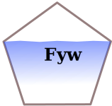

# Fyw <a href="https://github.com/tamnva/Fyw/blob/master/vignettes/icon.svg"></a>

[](https://github.com/tamnva/Fyw/actions) [](https://zenodo.org/badge/latestdoi/615738927)


## 1. Overview

- Fyw package provides several functions for finding the youngwater fraction and its related parameters (e.g., alpha, beta of the gamma distribution, age threshold of the young water fraction).

## 2. Installation

``` r

# Install devtools package if needed
if (!require(devtools)) install.packages("devtools")
library(devtools)

# If the package is in use, detach it before installing
detach("package:Fyw", unload = TRUE)

# Install Fyw package for github
install_github("tamnva/Fyw")
```

### 3. Example dataset (included in Fyw packaage)
These data are isotope (O18) concentrations in precipitation and streamflow

``` r
# Load Fyw package
library(Fyw)

# Example dataset
?isotopeData

# Other packages to run the example Rscript 
library(ggplot2)
library(lubridate)
```

## 4. Approach 1 (most precise/direct)
- Step 1: Fit observed isotope concentrations in precipitation to the following 
sine wave function $c = a \cdot sin(2 \cdot \pi \cdot t - phi) + k$, where $a$, 
$phi$, and $k$ are parameters need to be estimated.
- Step 2: Using convolution approach to convolve the fitted sine wave above with 
a gamma distribution to find isotope concentrations in streamflow with a gamma
distribution function. Users need to estimate the alpha (shape) and beta (scale) 
factors of the gamma distribution (trial and error). 
- Step 3: The young water fraction can be calculated using the cumulative gamma 
distribution (with best estimated alpha and beta values) for any age thresholds.

IMPORTANT: In this approach, we can fix the age threshold of the Fyw to any ages

DISADVANTAGE: Very high computational demand

### Step 1. Fit observed O18 in precipitation to sine wave function

``` r
# Get isotope data in precipitation (Alp catchment)
isotopeP_Alp <- subset(isotopeData, catchment == "Alp" & 
                       variable == "precipitation")

# Fit sine-wave to observed isotope concentrations in precipitation
fitSineP <- fitSineNL(observed = isotopeP_Alp$delta_18O, 
                      a = c(1,4), 
                      phi = c(0, 2*pi),
                      k = c(-15,-5), 
                      t = isotopeP_Alp$date, 
                      nIter = 5000,
                      nBestIter = 10, 
                      weight = isotopeP_Alp$water_flux_mm)

# Plot simulated isotope concentrations in precipitation (only for nBestIter)
ggplot()+
  geom_line(data = fitSineP$simulated, aes(x = date, y = simulated, color = simulation))+
  geom_point(data = fitSineP$observed, aes(x = date, y = observed))+
  labs(x = "", y = expression(paste(delta^{18}, "O concentration (‰)")), color = "") +  
  theme(legend.position = "none")

# Plot parameter values (only for nBestIter)

ggplot(stack(fitSineP$parameter[,-c(1)]))+
  geom_boxplot(aes(x = ind, y = values, fill = ind))+
  labs(x = "", y = "parameter value", fill = "") +  
  facet_wrap(. ~ ind, scales = "free")+
  theme(legend.position = "top")
```

### Step 2. Convolve the fitted sine wave with the gamma distribution 
``` r
# Get isotope data in streamflow (Alp catchment)
isotopeS_Alp <- subset(isotopeData, catchment == "Alp" & 
                         variable == "streamflow")

# Let's estimate parameters of the gamma distribution (trial and error)
estAlpha = 0.9
estBeta = 0.12

# isotope concentrations in streamflow
simIsoStream <- convolSineNL(AP = fitSineP$parameter$a[1],
                             phiP = fitSineP$parameter$phi[1], 
                             kP = fitSineP$parameter$k[1], 
                             estAlpha = estAlpha,
                             estBeta = estBeta, 
                             simulatedDate = isotopeS_Alp$date,
                             nWarmupYears = 5)

# Plot the estimate instream isotope concentration and observed data
ggplot()+
  geom_line(data = simIsoStream, aes(x = date, y = simulated, col = "Simulated"))+
  geom_point(data = isotopeS_Alp, aes(x = date, y = delta_18O, col = "Observed"))+
  scale_color_manual(values = c("Simulated" = "blue","Observed" = "black"))+
  labs(x = "", y = expression(paste(delta^{18}, "O streamflow (‰)")), color = "") +
  theme(legend.position = "top")
  
# NOTE: Above, we are lucky, the estimated instream isotope concentrations match
# quite well with observed with the first estimated alpha and beta values
```
### Step 3. Estimate the young water fraction with user-defined threholds
``` r
# Let's say we want to know the Fyw with age thresholds of tauyw = 0.2 years
# This Fyw (weighted) because Step 1 we used the weights = isotopeP$precippitation_mm
tauyw = 0.2
Fyw <- pgamma(tauyw, shape = estAlpha, scale = estBeta, lower.tail = TRUE)
```

